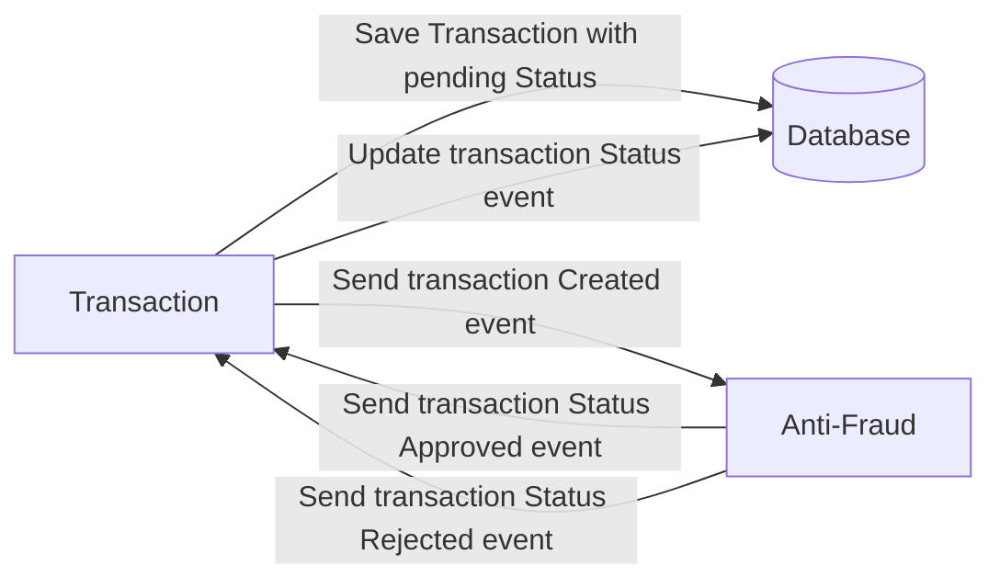

<<<<<<< HEAD
# Yape Code Challenge :rocket:

Our code challenge will let you marvel us with your Jedi coding skills :smile:. 

Don't forget that the proper way to submit your work is to fork the repo and create a PR :wink: ... have fun !!

- [Problem](#problem)
- [Tech Stack](#tech_stack)
- [Send us your challenge](#send_us_your_challenge)

# Problem

Every time a financial transaction is created it must be validated by our anti-fraud microservice and then the same service sends a message back to update the transaction status.
For now, we have only three transaction statuses:

<ol>
  <li>pending</li>
  <li>approved</li>
  <li>rejected</li>  
</ol>

Every transaction with a value greater than 1000 should be rejected.



# Tech Stack

<ol>
  <li>Node. You can use any framework you want (i.e. Nestjs with an ORM like TypeOrm or Prisma) </li>
  <li>Any database</li>
  <li>Kafka</li>    
</ol>

We do provide a `Dockerfile` to help you get started with a dev environment.

You must have two resources:

1. Resource to create a transaction that must containt:

```json
{
  "accountExternalIdDebit": "Guid",
  "accountExternalIdCredit": "Guid",
  "tranferTypeId": 1,
  "value": 120
}
```

2. Resource to retrieve a transaction

```json
{
  "transactionExternalId": "Guid",
  "transactionType": {
    "name": ""
  },
  "transactionStatus": {
    "name": ""
  },
  "value": 120,
  "createdAt": "Date"
}
```

## Optional

You can use any approach to store transaction data but you should consider that we may deal with high volume scenarios where we have a huge amount of writes and reads for the same data at the same time. How would you tackle this requirement?

You can use Graphql;

# Send us your challenge

When you finish your challenge, after forking a repository, you **must** open a pull request to our repository. There are no limitations to the implementation, you can follow the programming paradigm, modularization, and style that you feel is the most appropriate solution.

If you have any questions, please let us know.
=======

# 💸 Transactions Service

Este es un servicio backend de transacciones financieras desarrollado con **NestJS**, **Prisma**, **PostgreSQL** y **Kafka**, diseñado para escenarios como antifraude, procesamiento de pagos o sistemas bancarios internos.

---

## 📦 Tecnologías utilizadas

- [NestJS](https://nestjs.com/) – Framework backend modular basado en TypeScript
- [Prisma](https://www.prisma.io/) – ORM moderno y tipado para bases de datos SQL
- [PostgreSQL](https://www.postgresql.org/) – Base de datos relacional robusta
- [Kafka](https://kafka.apache.org/) – Sistema de mensajería distribuida (event-driven)
- [Docker Compose](https://docs.docker.com/compose/) – Orquestación de contenedores para entorno local

---

## 🚀 Funcionalidades del servicio

- Registro de transacciones con múltiples validaciones de negocio
- Emisión de eventos Kafka al crear una transacción válida (`PENDING`)
- Escucha de eventos `transaction.status` para actualización de estado
- Endpoints RESTful para consultar las transacciones

---

## 🧠 Validaciones implementadas

- ❌ Las cuentas de débito y crédito no pueden ser iguales
- ❌ El `transferTypeId` debe existir previamente en la base de datos
- ❌ El valor de la transacción debe ser mayor que 0
- ❌ Transacciones con valor mayor a 1000 son automáticamente rechazadas
- ✅ Solo se permite actualizar transacciones con estado `PENDING`
- ✅ Solo se aceptan estados `APPROVED` o `REJECTED` en actualizaciones

---

## ⚙️ Cómo levantar el proyecto localmente

### 1. Clonar el repositorio

```bash
git clone <repo-url>
cd app-nodejs-codechallenge
```

### 2. Instalar dependencias

```bash
npm install
```

### 3. Levantar servicios con Docker (PostgreSQL + Kafka)

```bash
docker compose up -d
```

> Asegúrate de tener Docker Desktop corriendo.

### 4. Ejecutar migraciones y generar el cliente Prisma

```bash
npx prisma migrate dev
npx prisma generate
```

### 5. Ejecutar datos iniciales (seed)

Automáticamente desde `main.ts` o manualmente:

```bash
npx ts-node prisma/seed.ts
```

### 6. Iniciar el servidor NestJS

```bash
npm run start:dev
```

> El servicio estará disponible en: `http://localhost:3000`

---

## 📬 Endpoints disponibles

### Crear una transacción

```
POST /transactions
```

**Body:**

```json
{
  "accountExternalIdDebit": "uuid",
  "accountExternalIdCredit": "uuid",
  "transferTypeId": 1,
  "value": 100.50
}
```

---

### Consultar transacción por ID

```
GET /transactions/:transactionExternalId
```

---

## 📡 Kafka

### 📤 Evento emitido: `transaction.created`

```json
{
  "transactionExternalId": "uuid",
  "value": 500
}
```

> Solo se emite si la transacción fue aceptada (`PENDING`).

---

### 📥 Evento recibido: `transaction.status`

```json
{
  "transactionExternalId": "uuid",
  "status": "APPROVED"
}
```

> Se actualiza el estado de la transacción si aún está en `PENDING`.

---

## ✅ Formato de respuesta esperado

```json
{
  "transactionExternalId": "uuid",
  "transactionType": {
    "name": "Transfer"
  },
  "transactionStatus": {
    "name": "PENDING"
  },
  "value": 120,
  "createdAt": "2025-06-15T20:50:00Z"
}
```

---

## 📁 Estructura del proyecto

```
src/
├── transactions/
│   ├── dto/
│   ├── transactions.controller.ts
│   ├── transactions.service.ts
├── validators/
│   └── transaction.validator.ts
├── constants/
│   └── transaction.constants.ts
├── kafka/
│   └── kafka.service.ts
prisma/
├── schema.prisma
├── seed.ts
```

---

## 👨‍💻 Autor

Desarrollado por **Alexander Chacchi**  
[GitHub: Scorpion2128](https://github.com/scorpion2128)
>>>>>>> 598692b (feat: add transactions with Kafka support)
